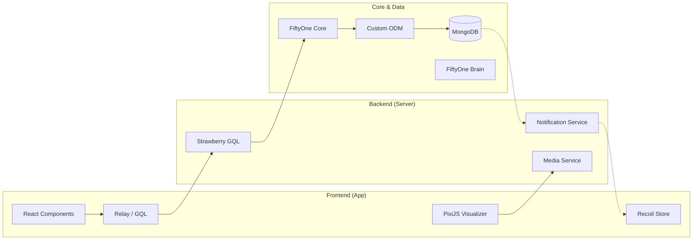

# FiftyOne Architecture & Tech Stack: Deep Dive

## 1. Executive Summary
FiftyOne is an open-source tool for building high-quality datasets and computer vision models. It utilizes a decoupled architecture where a high-performance Python backend handles data orchestration and ML operations, while a modern React-based frontend provides a rich, interactive visualization experience.

---

## 2. Tech Stack Reference

### Backend (Python)
- **Framework**: [Starlette](https://www.starlette.io/) (ASGI) for the web server.
- **GraphQL**: [Strawberry](https://strawberry.rocks/) for type-safe, code-first API definition.
- **Database**: [MongoDB](https://www.mongodb.com/) (Data persistence and real-time state sync).
- **Processing**:
  - `Numpy` & `Pillow`: Image and numerical data manipulation.
  - `FFmpeg`: Heavy lifting for video decoding and frame extraction.
- **Server**: `Hypercorn` (ASGI server implementation).

### Frontend (TypeScript/React)
- **Framework**: React with Function Components.
- **State Management**: [Recoil](https://recoiljs.org/) for atomic state management.
- **API Client**: [Relay](https://relay.dev/) (GraphQL with AOT compilation).
- **Build System**: [Vite](https://vitejs.dev/) with Yarn Workspaces (Monorepo).
- **Visualization Engineering**:
  - **PixiJS**: WebGL-powered engine for rendering millions of objects/masks.
  - **Plotly**: Interactive data analytics and distribution charts.
- **UI System**: Material UI (MUI).

---

## 3. Architecture Deep Dive

### A. Data Modeling (Custom ODM)
FiftyOne implements a specialized Object Document Mapper (ODM) located in `fiftyone.core.odm`.
- **Datasets**: Stored as root documents in the `datasets` collection.
- **Samples**: Each dataset has its own MongoDB collection (e.g., `samples.dataset_name`).
- **Views**: Not physical collections, but dynamic aggregation pipelines built in Python and executed on-the-fly.
- **Fields**: Supports complex nested types, including `Detection`, `Classification`, `Segmentation`, and `Keypoint`.

### B. The Integration Engine (Starlette + Strawberry)
The server layer (`fiftyone.server`) acts as the bridge:
1. **GraphQL API**: Defines the "Schema of Truth" for the App.
2. **Media Serving**: A high-efficiency route that resolves local and cloud paths (S3, GCS, Azure) and streams them to the browser.
3. **Session Management**: Tracks active Python sessions and their connection to specific UI instances.

### C. Real-time Synchronization (State & Events)
Synchronization between the Python environment and the Browser App is handled via a sophisticated event system:
- **MongoDB Change Streams**: The backend listens for database changes using `MongoChangeStreamNotificationService`.
- **SSE / WebSockets**: Events (like "Dataset Updated" or "Filter Changed") are pushed to the client.
- **Recoil State Mirroring**: The App's Recoil state acts as a local mirror of the backend's `application_state`.

- **Execution Models**: Supports **Immediate** (blocking) and **Delegated** (background job) execution.

### E. FiftyOne Brain & ML Analysis (`fiftyone.brain`)
The "Brain" is a specialized ML layer that provides statistical insights without training new models:
- **Mistakenness**: Identifies potential label errors or localization inaccuracies using model prediction logits.
- **Uniqueness**: Uses embeddings (CLIP, ResNet, etc.) to calculate a "uniqueness score" for weeding out redundant samples.
- **Similarity Search**: Integrates with backends like **FAISS**, **Milvus**, or **Qdrant** for semantic image/text similarity search.
- **Embeddings Visualization**: Implements dimensionality reduction (UMAP, t-SNE, PCA) to project high-dimensional features into a 2D interactive point cloud in the App.

---

## 4. Component Interaction Flow

## 5. Key Packages (Frontend Monorepo)
- `@fiftyone/state`: The unified Recoil state management.
- `@fiftyone/relay`: GraphQL fragments and mutation logic.
- `@fiftyone/looker`: The core "Looker" engine for image/video rendering.
- `@fiftyone/operators`: UI logic for the plugin system.
- `@fiftyone/spaces`: The flexible dashboard/panel layout system.
