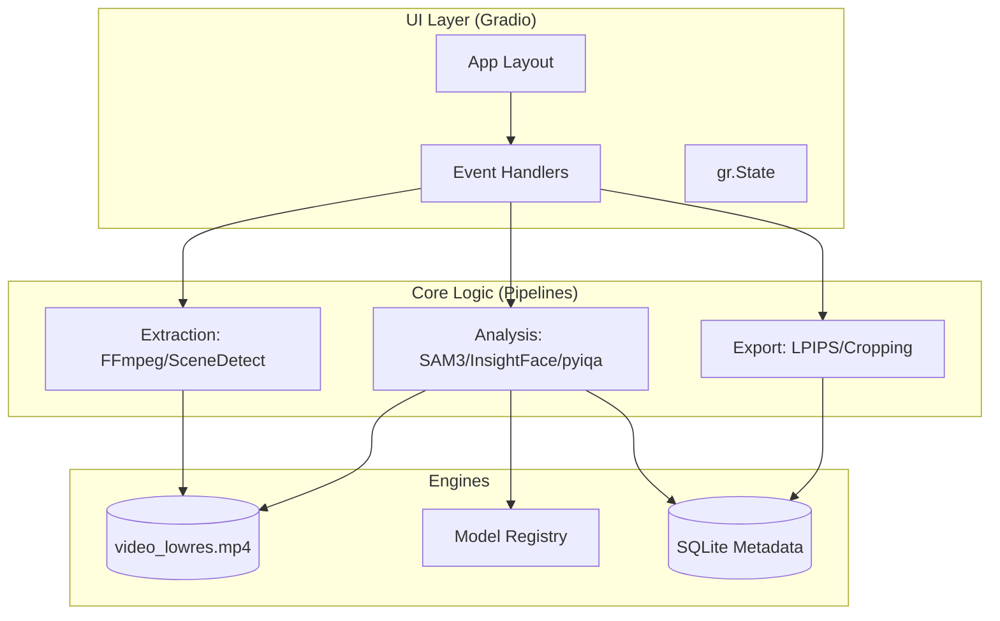

# Subject Frame Extractor Architecture & Tech Stack: Deep Dive

## 1. Executive Summary
The **Subject Frame Extractor** is a high-performance Python application designed for surgical extraction, multi-dimensional analysis, and heuristic-based filtering of video frames. By integrating state-of-the-art computer vision models—**SAM3** for temporal subject tracking, **InsightFace** for identity consistency, and **pyiqa** for perceptual quality assessment—it transforms raw footage into high-quality, curated datasets.

---

## 2. Tech Stack Reference

### Backend & Logic (Python 3.10+)
- **ML Framework**: [PyTorch](https://pytorch.org/) (Deep learning backend with CUDA/MPS/CPU support).
- **Subject Tracking**: **SAM3 (Segment Anything Model 2/3)**. Integrated as a git submodule (`SAM3_repo`) and abstracted via `core/managers.py`.
- **Face Analysis**:
  - **InsightFace**: Face detection and embedding-based similarity matching.
  - **MediaPipe**: 468-point face landmarking for blink detection and head pose estimation (Yaw/Pitch/Roll).
- **Quality Assessment**:
  - **pyiqa**: Naturalness Image Quality Evaluator (NIQE) for blind image quality assessment.
  - **OpenCV**: Laplacian-based sharpness and Sobel-based edge strength calculation.
- **Media Orchestration**:
  - **FFmpeg**: Hand-built filter chains for concurrent thumbnail/proxy generation.
  - **decord**: High-speed video decoding for secondary analysis.
  - **PySceneDetect**: Content-aware scene break detection.
- **Deduplication**:
  - **imagehash**: Perceptual hashing (pHash) for fast structural comparison.
  - **LPIPS**: Learned Perceptual Image Patch Similarity for deep-learning-based redundancy removal.

### Frontend (Gradio)
- **Framework**: [Gradio](https://gradio.app/) (v6).
- **Architecture**: Decoupled layout components (`ui/tabs/`) using Pydantic-based event contracts (`core/events.py`).

---

## 3. Architecture Deep Dive

### A. Modular Processing Pipelines (`core/pipelines.py`)
Processing is divided into stateful pipelines that minimize redundant I/O:

1.  **ExtractionPipeline**:
    *   **FFmpeg Filter Chains**: Orchestrates a complex `vf` (video filter) string combining `select` (frame sampling), `fps` (normalization), `scale` (thumbnail sizing), and `showinfo` (metadata extraction).
    *   **Low-Res Proxy**: Generates a `video_lowres.mp4` (fixed 360p height). SAM3 uses this proxy during propagation to eliminate the massive I/O overhead of reading uncompressed JPEGs.
2.  **AnalysisPipeline**:
    *   **Quality Ensemble**: Calculates a weighted score using:
        - **Sharpness**: Laplacian variance.
        - **Edge Strength**: Mean Sobel gradient magnitude.
        - **NIQE**: Perceptual naturalness via `pyiqa`.
        - **Face Metrics**: Blink probability and head-on pose alignment.
    *   **Identity Locking**: Chains InsightFace embeddings across scenes to ensure the "Subject" remains consistent throughout the video.
3.  **ExportPipeline**:
    *   **Hybrid Deduplication**: Implements a "pHash then LPIPS" strategy. Fast pHash isolates potential duplicates, which are then verified by the more computationally expensive LPIPS model for high-precision removal.

### B. Resource & Model Management (`core/managers.py`)
To prevent VRAM fragmentation and OOM errors:
- **ModelRegistry**: Acts as a thread-safe singleton. It manages the `device` placement (CUDA/Apple Silicon/CPU) and handles "VRAM Purging" when transitioning from GPU-intensive tracking to CPU-intensive export.
- **SAM3Wrapper**: Normalizes the Gradio coordinate system (absolute pixels) to SAM3's relative `[0, 1]` grid.

### C. Data Persistence (`core/database.py`)
- **SQLite Database**: A local `metadata.db` stores every frame's metrics.
- **Query Logic**: The UI interacts with the database via vectorized NumPy operations (`core/filtering.py`) for real-time slider-based filtering of 10,000+ frames.

---

## 4. Component Interaction Flow

---

## 5. Directory Map
- [core/models.py](file:///home/tazztone/_coding/subject-frame-extractor/core/models.py): Pydantic data schemas and Quality Metric logic (including `pyiqa` integration).
- [core/filtering.py](file:///home/tazztone/_coding/subject-frame-extractor/core/filtering.py): Vectorized filtering and deduplication logic (pHash/LPIPS).
- [SAM3_repo/](file:///home/tazztone/_coding/subject-frame-extractor/SAM3_repo): Upstream tracking implementation.
