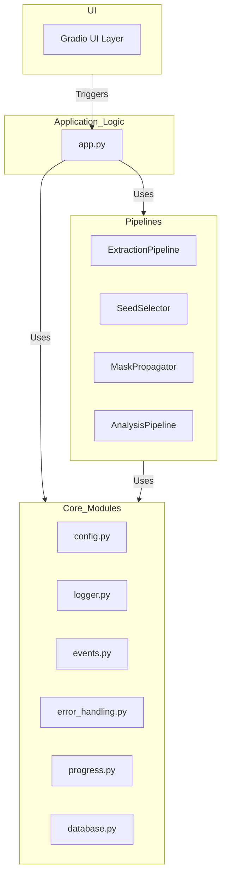

# 🎬 Subject Frame Extractor v2.0

An AI-powered tool for extracting, analyzing, and filtering high-quality frames from videos or YouTube URLs. Designed for content creators, dataset builders, and anyone needing precise video frame analysis with advanced subject detection and quality metrics.


## ✨ What This Tool Does

This application revolutionizes video frame extraction by combining traditional computer vision with cutting-edge AI models to:

- **Extract frames intelligently** from any video using multiple extraction strategies
- **Analyze frame quality** using comprehensive metrics (sharpness, contrast, entropy, NIQE)
- **Detect and track subjects** automatically using state-of-the-art segmentation models (SAM 2.1)
- **Filter by face similarity** to find frames of specific people
- **Export curated datasets** with smart cropping and aspect ratio options

Perfect for creating training datasets (LoRA/Dreambooth), finding thumbnail candidates, or analyzing video content at scale.

## 🚀 Key Features

### 🎯 Intelligent Frame Extraction
- **Multiple extraction methods**: keyframes, intervals, scene detection, or every frame
- **YouTube integration**: Direct URL processing with resolution control
- **Smart scene detection**: Automatically identify unique shots and transitions
- **Flexible timing**: Custom intervals or N-th frame extraction

### 🧠 Advanced AI Analysis
- **Subject Segmentation**: Uses **SAM3** for precise subject tracking and masking
- **Face Recognition**: **InsightFace**-powered similarity matching with reference photos
- **Quality Assessment**: Multi-metric scoring including **NIQE** perceptual quality
- **Person Detection**: **YOLOv11**-based human detection for seeding subject tracking
- **Text-to-Object**: Use text prompts with **Grounded-DINO** to identify subjects

### 🔍 Powerful Filtering System
- **Real-time filtering**: Interactive sliders for all quality metrics
- **Face similarity matching**: Find frames containing specific people
- **Subject-focused analysis**: Quality metrics calculated only on main subjects
- **Duplicate detection**: Perceptual hash-based near-duplicate removal

### 📤 Smart Export Options
- **Intelligent cropping**: Automatic subject-centered cropping with padding
- **Multiple aspect ratios**: 16:9, 1:1, 9:16, or custom ratios
- **Batch processing**: Export hundreds of frames with consistent formatting
- **Resume capability**: Pause and resume analysis without losing progress

## 💻 Installation

### 🪟 Windows (Automated Method)

We provide batch scripts to automate the setup process.

1.  **Install / Update**:
    Run `windows_STANDALONE_install.bat` to clone the repo and set up the environment automatically.
    *Note: This script is designed to be run from a parent folder to create a new installation.*

2.  **Run the App**:
    Double-click `windows_run_app.bat`. This will activate the virtual environment and launch the UI in your browser.

3.  **Update**:
    Run `windows_update.bat` to pull the latest changes and update dependencies.

### 🐧 Linux / macOS / Manual Windows

1.  **Clone the repository:**
    ```bash
    git clone --recursive https://github.com/tazztone/subject-frame-extractor.git
    cd subject-frame-extractor
    ```
    *Note: The `--recursive` flag is critical to fetch the SAM3 submodule.*

2.  **Create a virtual environment:**
    ```bash
    python3 -m venv venv
    source venv/bin/activate  # On Windows: venv\Scripts\activate
    ```

3.  **Install dependencies:**
    ```bash
    pip install -r requirements.txt
    # Install SAM3 directly from the submodule or source if not covered by requirements
    pip install git+https://github.com/facebookresearch/sam3.git
    ```

4.  **Install FFmpeg:**
    Ensure FFmpeg is installed and in your system PATH.
    - **Ubuntu/Debian**: `sudo apt install ffmpeg`
    - **macOS**: `brew install ffmpeg`

## 📖 How to Use

The application provides a guided, five-tab workflow.

### Tab 1: 📹 Frame Extraction
**Get frames from your video source.**
1.  **Source**: Paste a YouTube URL or upload a video file.
2.  **Method**: Use "Thumbnail Extraction" (Recommended) for fast pre-analysis, or legacy methods for full extraction.
3.  **Start**: Results are saved to `downloads/` and auto-loaded for the next step.

### Tab 2: 👩🏼‍🦰 Define Subject
**Identify your subject within the scenes.**
1.  **Strategy**:
    -   **👤 By Face**: Upload a reference photo.
    -   **📝 By Text**: Describe the subject (e.g., "man in red shirt").
    -   **🤖 Automatic**: Finds the most prominent person.
2.  **Find Seeds**: Click **"Find & Preview Best Frames"** to identify the best "seed frame" per scene.

### Tab 3: 🎞️ Scene Selection
**Refine selection before heavy processing.**
1.  **Review**: Check the gallery of seed frames.
2.  **Edit**: Override detections (change person, use text) or exclude scenes.
3.  **Propagate**: Click **"Propagate Masks"** to track the subject through all frames in selected scenes using SAM3.

### Tab 4: 📝 Metrics
**Configure analysis.**
Choose which metrics to calculate (Sharpness, NIQE, Face Similarity, etc.).

### Tab 5: 📊 Filtering & Export
**Curate and save.**
1.  **Filter**: Use sliders to filter by quality metrics.
2.  **Deduplicate**: Remove similar frames using pHash/SSIM.
3.  **Export**: Enable **"Crop to Subject"**, set aspect ratios (e.g., `1:1, 9:16`), and save your dataset.

## 🏗️ Technical Architecture

The application is built as a monolithic desktop app using **Python** and **Gradio**. It follows an event-driven architecture where the UI triggers backend pipelines via typed events.

### System Diagram



### Core Infrastructure

*   **`config.py`**: Central configuration using Pydantic `BaseSettings`. Loads from `.env` and `config.json`.
*   **`logger.py`**: Structured logging (`AppLogger`) that writes to console (colored) and disk (JSONL), and streams to the UI.
*   **`error_handling.py`**: Robust error handling with decorators like `@with_retry` and `@handle_common_errors`.
*   **`database.py`**: SQLite database for efficient frame metadata storage and retrieval.
*   **`ModelRegistry`**: A thread-safe singleton in `app.py` for lazy-loading and managing heavy ML models (SAM3, InsightFace).

### Processing Pipelines

1.  **Extraction (`ExtractionPipeline`)**: Handles video ingestion, validation, scene detection (PySceneDetect), and frame extraction (FFmpeg).
2.  **Seeding (`SeedSelector`)**: Determines the subject to track in each scene using strategies like Face Recognition (InsightFace), Text Prompts (Grounded-DINO/SAM3), or Automatic detection.
3.  **Propagation (`MaskPropagator`)**: Uses **SAM3** to propagate the subject mask from the seed frame forward and backward through the scene.
4.  **Analysis (`AnalysisPipeline`)**: Computes quality metrics (NIQE, Sharpness, Contrast) and content metrics (Face Similarity) for every frame.

### Data Model

*   **`Frame`**: Pydantic model representing a single video frame and its metrics.
*   **`Scene`**: Represents a continuous video shot.
*   **Events**: Typed Pydantic models (e.g., `ExtractionEvent`, `PreAnalysisEvent`) used for UI-Backend communication.

## 👨‍💻 Developer Guide

### Project Structure

```
subject-frame-extractor/
├── app.py                     # Main application UI and logic
├── config.py                  # Configuration
├── logger.py                  # Logging
├── events.py                  # Event models
├── database.py                # Database layer
├── SAM3_repo/                 # SAM3 Submodule
├── tests/                     # Test suite
└── AGENTS.md                  # Detailed developer notes & patterns
```

### Testing

*   **Backend**: `python -m pytest tests/`
*   **Frontend**: `pytest tests/e2e/` (Requires Playwright)

For more detailed developer instructions, coding standards, and common pitfalls, please refer to **[AGENTS.md](AGENTS.md)**.

## 🔍 Troubleshooting

-   **FFmpeg not found**: Ensure it's in your system PATH.
-   **CUDA OOM**: Process fewer frames or reduce video resolution. SAM3 is memory-intensive.
-   **Installation Issues**: Ensure git submodules are updated (`git submodule update --init --recursive`).

## 🤝 Contributing

Contributions are welcome! Please feel free to submit a Pull Request.

## 📄 License

This project is licensed under the MIT License - see the [LICENSE](LICENSE) file for details.
