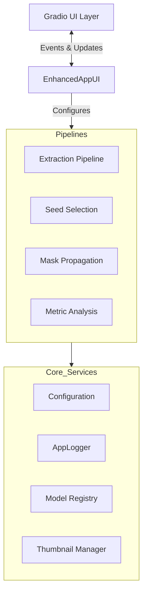

# Technical Documentation: Frame Extractor & Analyzer v2.0

## 1. Executive Summary

The **Frame Extractor & Analyzer** is a sophisticated, monolithic desktop application built with Python and Gradio. It is designed to automate the creation of high-quality image datasets from video sources. The system leverages state-of-the-art computer vision models (SAM2, GroundingDINO, YOLOv11, InsightFace) to perform intelligent subject tracking, segmentation, and aesthetic quality assessment.

## 2. System Architecture

The application follows a **Composition Root** design pattern, ensuring loose coupling between components. It operates on an event-driven architecture where the UI triggers backend pipelines via typed events, and the backend streams status updates back to the UI via a thread-safe queue.

### 2.1 High-Level Diagram

## 3. Core Infrastructure

### 3.1 Configuration Management
*   **Class:** `Config` (Pydantic `BaseSettings`)
*   **Function:** Centralizes all application settings, including model URLs, file paths, default thresholds, and hardware preferences.
*   **Sources:** Loads from environment variables (`.env`), a local `config.json`, and defaults.
*   **Validation:** Ensures critical paths exist and quality weights sum to non-zero values.

### 3.2 Logging & Telemetry
*   **Class:** `AppLogger`
*   **Features:**
    *   **Dual Output:** Writes human-readable colored logs to the console and structured JSONL logs to disk for auditing.
    *   **UI Streaming:** Pushes log events to a `Queue` to display real-time status in the application footer.
    *   **Context Managers:** The `operation()` context manager automatically tracks execution time and success/failure states of blocks of code.

### 3.3 Resource Management
*   **`ModelRegistry`:** A thread-safe singleton that handles the lazy loading of large ML models (e.g., SAM2, GroundingDINO). It ensures models are only loaded when needed and manages GPU device placement.
*   **`ThumbnailManager`:** Implements an LRU (Least Recently Used) cache for image thumbnails to minimize disk I/O latency during UI interactions (e.g., scrolling through the scene gallery).
*   **`safe_resource_cleanup`:** A context manager that forces Python garbage collection and clears the CUDA cache to prevent VRAM leaks between pipeline stages.

### 3.4 Error Handling
*   **Class:** `ErrorHandler`
*   **Decorators:**
    *   `@with_retry`: Automatically retries transient failures (like network timeouts) with exponential backoff.
    *   `@with_fallback`: Executes a secondary function if the primary one fails (e.g., falling back to CPU if GPU inference fails).

## 4. Data Model

### 4.1 Domain Objects
*   **`Frame`:** Encapsulates a single video frame, holding its pixel data (lazy-loaded) and a dictionary of computed metrics.
*   **`Scene`:** Represents a continuous shot in the video (start/end frame indices). It acts as the unit of work for the "Seeding" and "Propagation" stages.
*   **`SceneState`:** A wrapper around `Scene` that manages state transitions (e.g., user overrides, inclusion status) and ensures data consistency.

### 4.2 Event Objects
Communication between the UI and backend is strictly typed using Pydantic models:
*   `ExtractionEvent`: Parameters for video ingestion and frame extraction.
*   `PreAnalysisEvent`: Configuration for subject detection and seed selection.
*   `PropagationEvent`: Settings for the SAM2 mask propagation process.
*   `FilterEvent`: Criteria for the post-processing filtering stage.

## 5. Processing Pipelines

### 5.1 Stage I: Ingestion & Extraction
**Class:** `ExtractionPipeline` / `EnhancedExtractionPipeline`
1.  **Validation:** Checks video integrity using OpenCV.
2.  **Scene Detection:** Uses `PySceneDetect` (ContentDetector) to segment the video into logical shots.
3.  **Extraction:** Wraps `FFmpeg` to extract frames based on user preference (Keyframes, Interval, or Every Nth Frame).
4.  **Thumbnailing:** Generates lightweight WebP thumbnails for the UI.

### 5.2 Stage II: Subject Definition (Seeding)
**Class:** `SeedSelector`
Determines *what* to track in each scene using one of four strategies:
1.  **Identity-First:** Uses **InsightFace** to find a face matching a reference image.
2.  **Text-Prompt:** Uses **GroundingDINO** to find objects matching a text description (e.g., "a red car").
3.  **Automatic:** Uses **YOLOv11** to find the most prominent person (based on size, centrality, and confidence).
4.  **Hybrid:** Tries Identity matching first, falling back to Text or Automatic methods.

### 5.3 Stage III: Propagation
**Class:** `MaskPropagator`
1.  **Initialization:** Loads the **SAM2 (Segment Anything Model 2)** tracker.
2.  **Seeding:** Initializes the tracker with the bounding box found in Stage II.
3.  **Bi-Directional Tracking:** Propagates the mask forward and backward from the seed frame to cover the entire scene.
4.  **Refinement:** Applies morphological operations (closing/opening) to clean up the generated masks.

### 5.4 Stage IV: Analysis
**Class:** `AnalysisPipeline`
Computes a suite of metrics for every frame:
*   **Aesthetics:** NIQE (Natural Image Quality Evaluator), Laplacian Sharpness, Entropy, Contrast.
*   **Content:** Face Similarity (cosine distance), Subject Mask Area %.
*   **Deduplication:** Perceptual Hash (pHash) calculation.

## 6. Post-Processing & Export

### 6.1 Vectorized Filtering
Uses `NumPy` to perform high-speed filtering on thousands of frames instantly. Users can filter by any computed metric (e.g., "Show me frames with Sharpness > 2000 AND Face Similarity > 0.6").

### 6.2 Deduplication
Removes redundant frames using configurable methods:
*   **pHash:** Fast, good for exact duplicates.
*   **SSIM:** Structural Similarity Index.
*   **LPIPS:** Learned Perceptual Image Patch Similarity (deep learning-based, most accurate but slowest).

### 6.3 Export
*   **Cropping:** Optionally crops images to specific aspect ratios (16:9, 1:1, 9:16) centered on the subject mask.
*   **Format:** Saves final images as PNG or JPG.

## 7. User Interface (Gradio)

*   **`AppUI`:** Defines the visual layout, tabs, and widgets.
*   **`EnhancedAppUI`:** Inherits from `AppUI` and implements the business logic.
    *   **Thread Management:** Uses `ThreadPoolExecutor` to run pipelines in the background without freezing the UI.
    *   **Session Management:** Handles "Save/Load Session" functionality, persisting `scenes.json` and `scene_seeds.json` to disk.
    *   **Interactive Gallery:** A custom pagination system for reviewing thousands of scenes, with support for manual overrides (changing the tracked subject per scene).

## 8. Dependencies

*   **Core:** `gradio`, `pydantic`, `numpy`, `opencv-python`
*   **ML/Vision:** `torch`, `torchvision`, `ultralytics` (YOLO), `mediapipe`, `insightface`, `groundingdino`, `SAM3`, `pyiqa`
*   **Utilities:** `ffmpeg-python`, `yt-dlp`, `scenedetect`